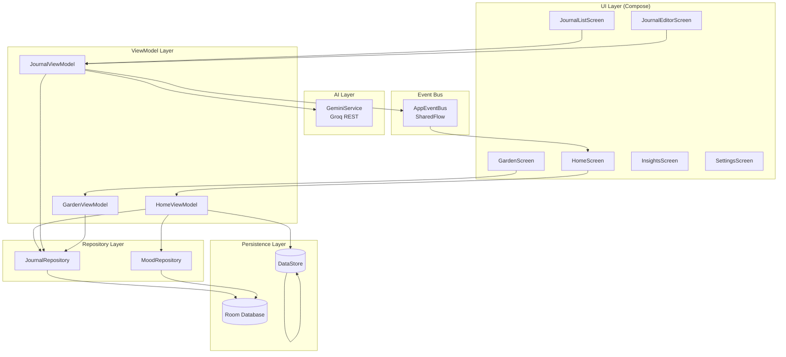
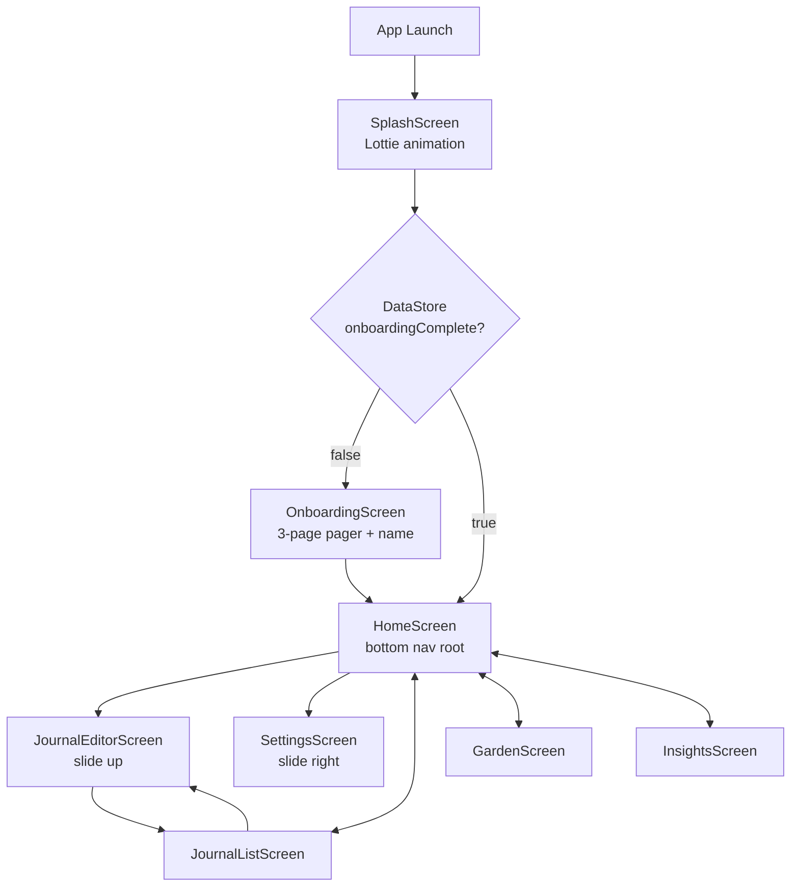
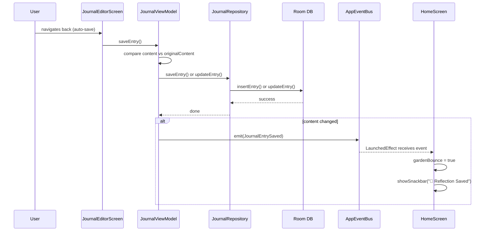
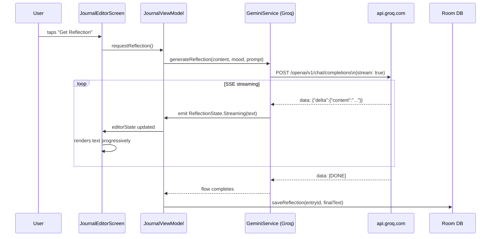
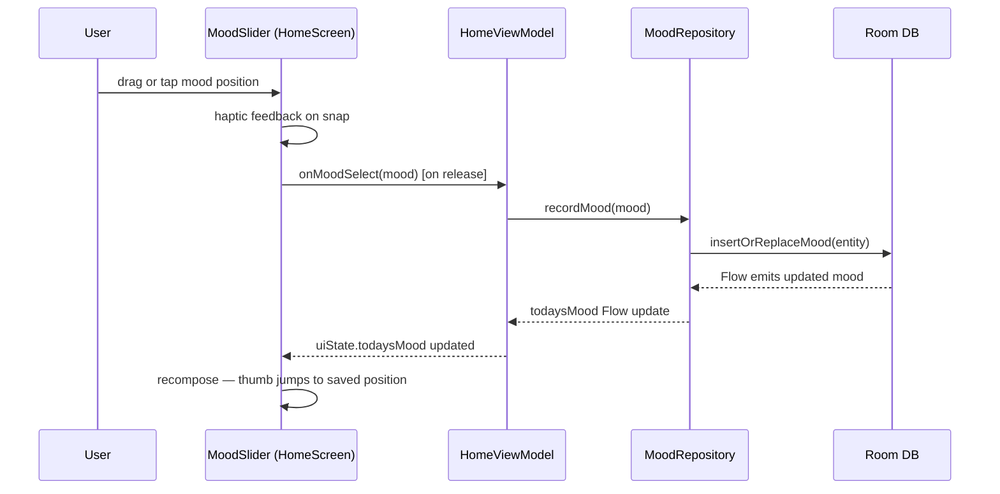
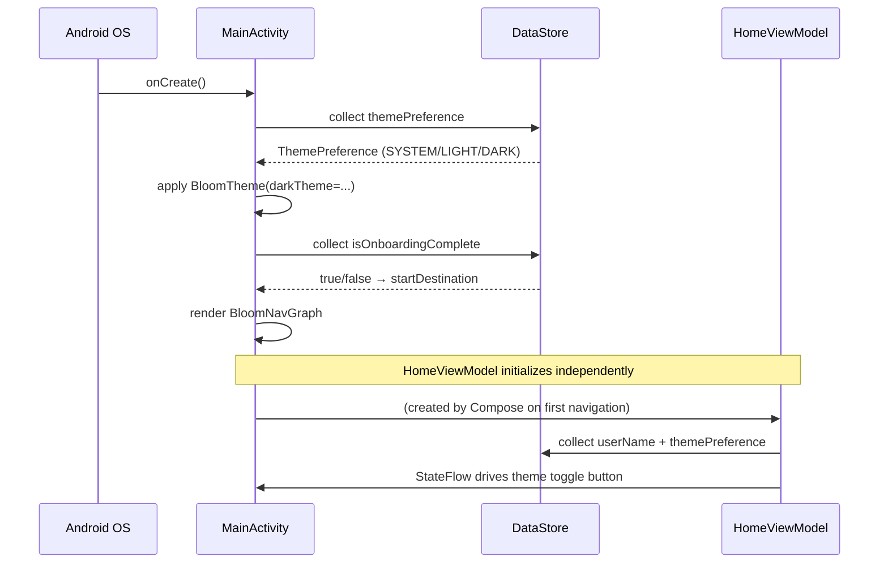
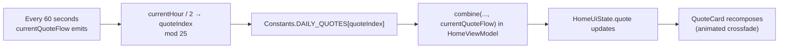
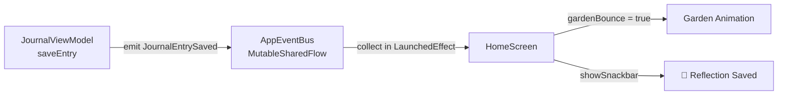

# Bloom — Data Flow

> Detailed diagrams for every major data flow in the application.

---

## Overall Architecture

---

## Navigation Flow

---

## Journal Save Flow

---

## AI Reflection Flow

---

## Mood Flow

---

## App Startup / Theme Flow

---

## Quote Rotation

---

## Event Bus

